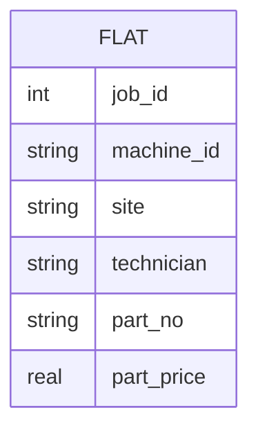
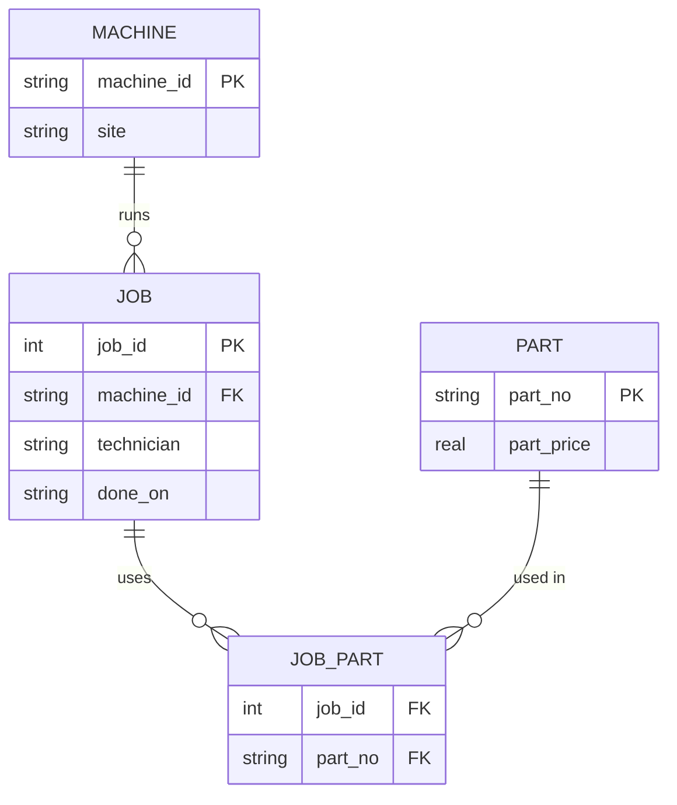

```mermaid
erDiagram
  FLAT { int job_id string machine_id string site string technician string part_no real part_price }
```

```mermaid
erDiagram
  MACHINE ||--o{ JOB : "runs"
  JOB ||--o{ JOB_PART : "uses"
  PART ||--o{ JOB_PART : "used in"
  MACHINE { string machine_id PK string site }
  JOB { int job_id PK string machine_id FK string technician string done_on }
  PART { string part_no PK real part_price }
  JOB_PART { int job_id FK string part_no FK }
```